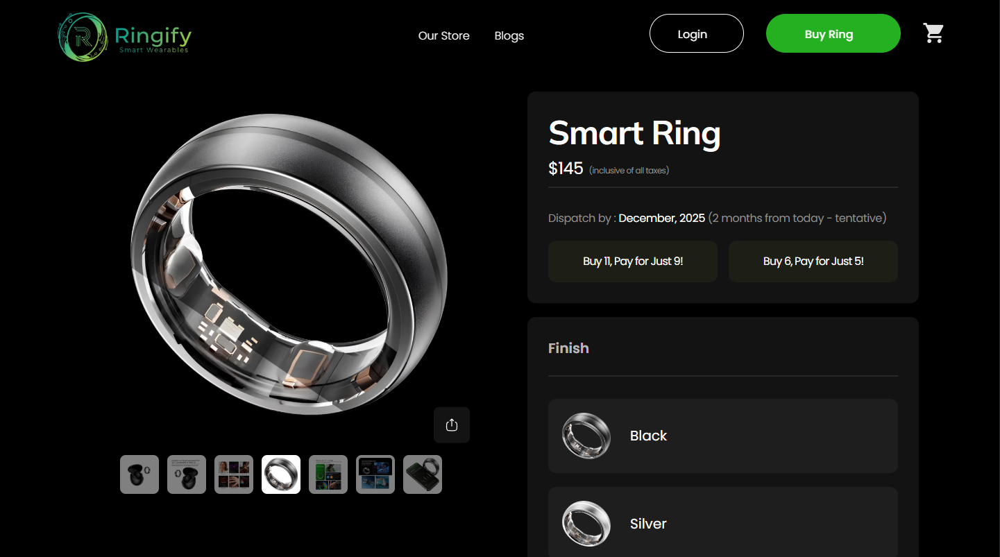

# Project Overview
### Project Name: Ringify - The Future of Smart Wearable Commerce
**Description:** Ringify is a Next.js full-stack e-commerce platform designed for a premium smart ring sell. Focused exclusively on customizable rings, it delivers a refined blend of elegant UI, secure transactions, and personalized user engagement.

The platform integrates a dynamic offer system, real-time cart updates, OTP-based authentication, discount handling, and automated order notifications, ensuring a professional-grade, end-to-end e-commerce flow. With secure payment processing, multi-address management, and email confirmation workflows, Ringify sets a high standard for modern online retail solutions..

Built with Next.js, TailwindCSS, and shadcn/ui, Ringify offers a highly responsive, visually captivating interface paired with robust backend functionalities powered by Mongoose, Stripe.js, and Resend. From product exploration to checkout, every step of the user journey is optimized for performance, reliability, and conversion.

### 🚀Key Features

**💡 Smart Wearable Product Focus** – Dedicated platform for the Ringify Smart Ring, offering detailed insights into health metrics like sleep, SpO₂, heart rate, temperature, and daily activity.

**🛍️ Full E-Commerce Workflow** – Complete buying journey with product selection, customization (size, color, model), cart management, and checkout — fully integrated with Stripe payment processing.

**🎯 Dynamic Offer System** – Built an intelligent incentive mechanism:
- Buy 5, Get 1 Free and Buy 9, Get 2 Free, dynamically triggered with real-time feedback and offer modals.

**🧮 Real-Time Cart & Price Engine** – Advanced cart system supporting quantity updates, size/color changes, and live offer-based total recalculations.

**🔐 OTP-Based Authentication & Authorization** – Secure login and registration flow with email OTP verification, password reset, and session management powered by Resend.

**🏠 Address Management System** – Users can add, update, and manage multiple shipping addresses using a strongly validated form for smooth checkout experiences.

**💳 Stripe-Powered Checkout Flow** – Integrated Stripe.js Hosted Checkout, ensuring fast, secure, and transparent payment processing with live invoice generation.

**📧 Automated Email Notifications** –
- Customers receive detailed order confirmations and invoices.
- Admins are instantly notified of new orders and payments for operational tracking.

**📱 Modern, Responsive UI/UX** – Built with TailwindCSS and shadcn/ui, providing a sleek, adaptive, and premium design that aligns with the smart-tech brand identity.

**⚙️ Full-Stack Architecture** –
- Frontend & Backend: Next.js  
- Database: MongoDB (Mongoose ODM)  
- Payment Gateway: Stripe.js  
- Email & OTP: Resend  
- UI Framework: TailwindCSS + shadcn/ui

## Repository/Project Information
**Version:** `0.02`  
**Last Release Date:** `12/10/2025`  
**Latest Stable Branch:** `main`  
**Active Development Branch:** `development`  
**Hosted Link:** `https://ringify-seven.vercel.app/`  

## Build Instructions

**1. Clone the Repository**  
Run the following commands in your terminal:

```bash
 git clone https://github.com/naeemmahmud70/ringify-fullstack-ecommerce
 cd ringify-fullstack-ecommerce
```

**2. Install Dependencies**  
Use one of the following commands to install project dependencies:

```bash
 # Using npm
 npm install

 # OR using yarn
 yarn install
```

**3. Configure Environment Variables**  
Create a `.env` file in the root directory and add the following example configuration:

```bash

NEXT_PUBLIC_BASE_URL=
NEXT_PUBLIC_BASE_PRICE=
NEXT_PUBLIC_PROMO_OFFER_1=
NEXT_PUBLIC_PROMO_OFFER_2=

#database
MONGODB_URI=
JWT_SECRET=
JWT_EXPIRES_IN=
COOKIE_NAME=
OTP_EXPIRY_MINUTES=
FORGET_PASSWORD_OTP_EXPIRY_MINUTES=
DICCOUNT_CODE=
DISCOUNT_PERCENTAGE=

#email sending
SEND_METHOD=
RESEND_API_KEY=
FROM_EMAIL=

# payment integration
STRIPE_SECRET_KEY=
NEXT_PUBLIC_STRIPE_PUBLISHABLE_KEY=
 ```
Do not commit this file. Make sure it is listed in your `.gitignore`.

**4. Build the App (if using TypeScript or build step)**  
If your project requires a build step, run:

```bash
 npm run build
 # OR
 yarn build
```

**5. Run the App**  
Use one of the following commands to start the server:

```bash
 # For production
  npm start

 # For development with hot-reloading
 npm run dev
 # OR
 yarn dev
```
**6. Troubleshooting Tips**  
 - Ensure Node.js and npm/yarn are installed: `node -v` and `npm -v`
 - If you are facing issue while installing npm install then try with npm install –force
 - Check for missing environment variables or file misconfigurations